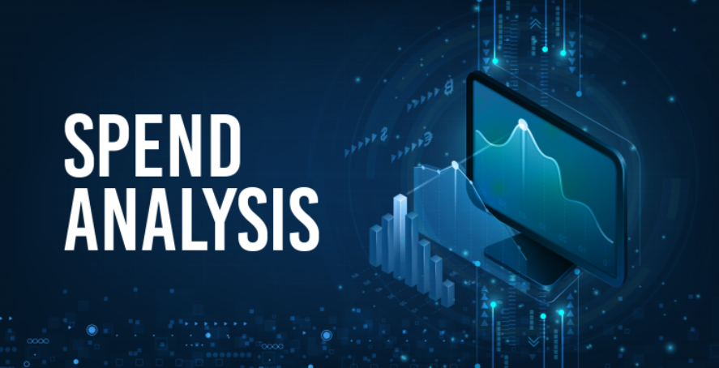
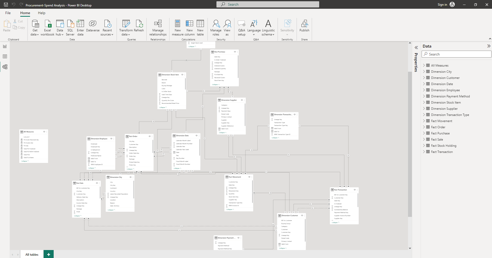
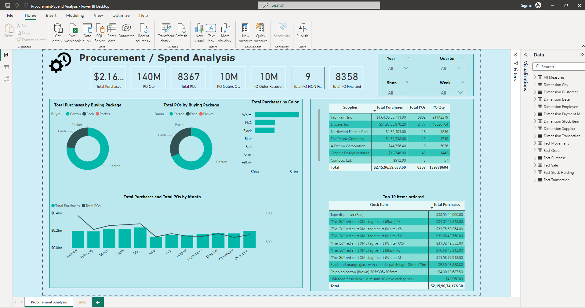

# Procurement-Spend-Analysis

---

## Introduction

This is a Power BI project on procurement or spend analysis. Spend analysis is a process of collecting, cleaning, classifying, analyzing expenditure data with the purpose of decreasing procurement cost, also improving efficiency and monitoring control and compliance or governance. It can also be used to optimize inventories. So it is a very important part of every manufacturing business.
**_Disclaimer_**: _All datasets and reports do not represent any company, institution or country, but just a dummy dataset to demonstrate capabilities of Power BI._ 

## Problem Statement 
1. How to make better decisions for company based upon their dimensional and fact tables?

## Skills/ concepts demonstrated
1. Creating Measures Table
2. Distinctcount
3. Sumx
4. Calculate
5. Sum
6. Filters

## Modelling

Automatically derived relationships are adjusted to remove and replace unwanted relatinships with the required.

The model is snowflake schema.

There are 8- dimension tables and 6 fact tables. 

## Visualization

## Conclusions

1. We can come to conclude about top purchases, top purchases by item, top suppliers and etc..,

